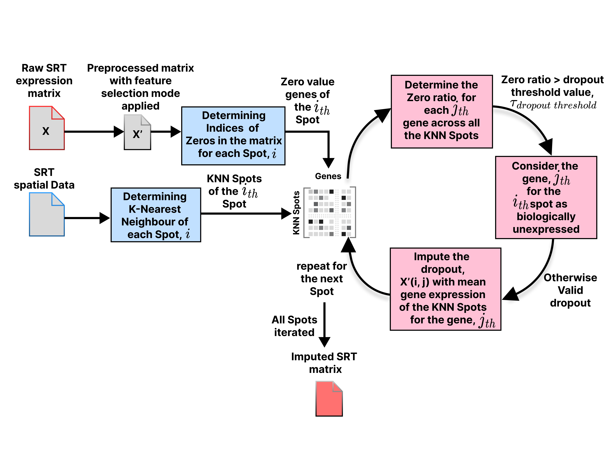

[](https://badge.fury.io/py/SpaMeanImpute)
### Spatial Information Matters: Are Traditional Imputation Methods Effective for Spatial Transcriptomics Data?

**TL;DR:** Python implementation of SRT Imputation Benchmark and new Imputation Framework SpaMeanImpute proposed.

- scRNA, SRT-based imputation, and general imputation methods are benchmarked on 5 different spatial transcriptomic technologies.
- Performance of the imputation methods shows inconsistent performance.
- Proposed a spatial aware imputation method with dropout detection ability for SRT datasets.
- Integration of Spatial Data in imputation improves the imputation capability significantly.


## Table of Contents
- [Benchmakring](#ST_impute_benchmarking)
- [Proposed Imputation Framework](#Proposed_Imputation_Framework)

## ST_impute_benchmarking
 A benchmarking analysis of general imputation methods, scRNA-seq, and Spatially Resolved Transcriptomics (SRT) based imputations on different Spatial Transcriptomics Technologies.

## Overview
This benchmarking provides a complete pipeline for gene selection, imputation, and clustering using multiple imputation methods and Leiden clustering. The workflow is designed for flexibility, allowing users to process datasets efficiently based on their computational power.

### Features
- **Gene Selection Criteria**: 
  - All genes
  - Top 2000 genes
  - Top 5000 genes
- **Imputation Methods**:
  - MAGIC
  - KNN
  - Soft Impute
  - Simple Impute
  - scVI
  - gimVI
  - Tangram
  - More imputation Methods (Easily extendable within the `Imputation Evaluator` class)
- **Clustering**: Leiden clustering is utilized for inference.
- **Batch Processing Modes**:
  - **Full Batch Mode**: Processes all `.h5ad` files in a directory, executing runs for all genes, top 2000 genes, and top 5000 genes before saving results in a `.csv` file.
  - **Semi Batch Mode**: Allows processing of a specified number of datasets at a time.
  - **Multi-batch Mode**: Enables parameterized batch processing, where:
    - First parameter determines the number of datasets processed at once.
    - Second parameter controls the number of gene selection criteria to apply.

The flexible batch modes ensure that different computational setups can process datasets optimally without excessive delays.

## Dataset Information
The following datasets are used:
- 10x Genomics Visium
- Stereo-seq
- Slide-seqV2
- sci-Space
- XYZeq

Additionally, key evaluation metrics such as **ARI, NMI, HOMO, AMI, zero sparsity, runtime, and memory usage** are calculated for each imputation method.

### Dataset Links
You can access the datasets here:
- **Processed Datasets Link**: [Dataset Link](https://drive.google.com/drive/folders/1mNmJe9xVNpLtMlJGBOsdc9aJEleVhr36?usp=sharing)

## Proposed_Imputation_Framework
We also propose a scalable, fast, and efficient imputation method, 'SpaMean-Impute', that is implemented in Python. SpaMeanImpute is a Python package for imputing missing gene expression values in spatial transcriptomics datasets.  
It leverages spatial neighborhood information to improve downstream clustering and analysis.


---

## ✨ Features

- **Spatially-aware imputation** using k-nearest neighbors in spatial coordinates.
- **Highly variable gene selection** with `scanpy`.
- **Evaluation pipeline** for imputation and clustering performance.
- **Command-line interface (CLI)** for easy integration into workflows.
- **Compatible with `.h5ad` AnnData files**.

---

## 📦 Installation

You can install SpaMeanImpute from PyPI:

```bash
pip install SpaMeanImpute
pip install igraph
pip install leidenalg
```
Or install directly from the GitHub repository:
```bash
git clone https://github.com/FahimHafiz/SpaMean-Impute/tree/main/SpaMeanImpute
cd SpaMeanImpute
pip install igraph
pip install leidenalg
pip install -e .
```

## 🚀 Usage

After installation, you can run:
```bash
spamean-impute input_file.h5ad \
    -k 9 \
    --threshold 0.1 \
    --n_top 5000 \
    --output_file imputed_output.h5ad
```

Arguments:

input_file — Path to input .h5ad file.

-k — Number of spatial neighbors (default: 9).

--threshold — Drop threshold for zero imputation (default: 0.1).

--n_top — Number of highly variable genes (default: 5000, use 'all' to skip filtering).

--output_file — Path to save the imputed .h5ad file.


## 🐍 Python API

```python
import spa_mean_impute
from spa_mean_impute.imputer import SpaMeanImpute

imputer = SpaMeanImpute(k=9, threshold=0.1, n_top=5000)
results = imputer.run("input_file.h5ad", output_file="imputed_output.h5ad")

print("Results:", results)
```


## 📁 Project Structure

spa_mean_impute/
    __init__.py
    imputer.py
    cli.py
    utils.py
tests/
    test_imputer.py
setup.py
pyproject.toml
README.md
LICENSE.txt


## ✅ Running Tests

python -m unittest discover tests


## 📄 License

This project is licensed under the MIT License — see the LICENSE.txt file for details. For any problem, feel free to contact [fahimhafiz@cse.uiu.ac.bd](fahimhafiz@cse.uiu.ac.bd) or create an issue!

Enjoy using the pipeline, and investigate your imputation analysis with ease!
